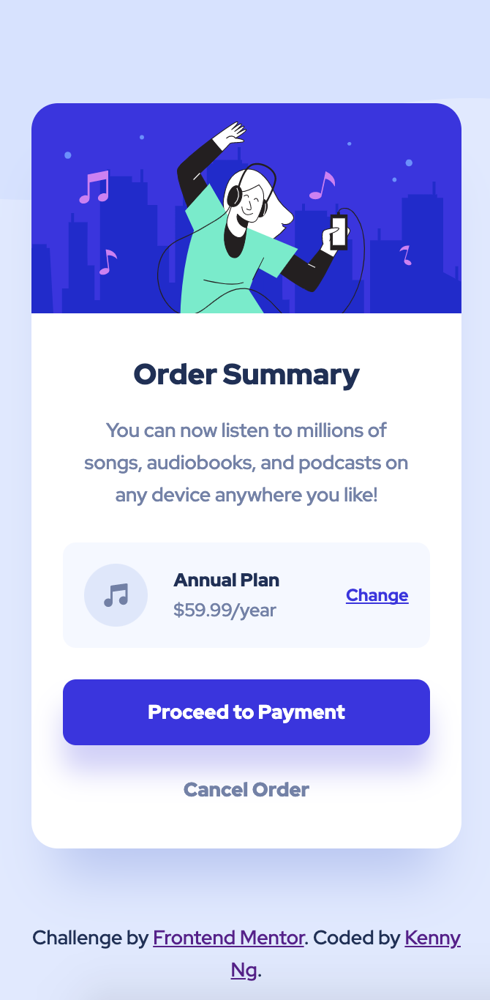

# Frontend Mentor - Order summary card solution

This is a solution to the [Order summary card challenge on Frontend Mentor](https://www.frontendmentor.io/challenges/order-summary-component-QlPmajDUj). Frontend Mentor challenges help you improve your coding skills by building realistic projects.

## Table of contents

- [Overview](#overview)
  - [The challenge](#the-challenge)
  - [Screenshot](#screenshot)
  - [Links](#links)
- [My process](#my-process)
  - [Built with](#built-with)
  - [What I learned](#what-i-learned)
  - [Useful resources](#useful-resources)
- [Author](#author)

## Overview

### The challenge

Users should be able to:

- See hover states for interactive elements

### Screenshot

Desktop version

Mobile version

### Links

- Solution URL: [https://www.frontendmentor.io/solutions/order-summary-card-z0YHXA1xz0](https://www.frontendmentor.io/solutions/order-summary-card-z0YHXA1xz0)
- Live Site URL: [https://kennylun123.github.io/fm-order-summary-component/](https://kennylun123.github.io/fm-order-summary-component/)

## My process

### Built with

- Semantic HTML5 markup
- CSS custom properties
- Flexbox
- CSS Grid
- Mobile-first workflow

### What I learned

CUBE methodology

### Useful resources

- [CUBE CSS blog by Andy bell](https://andy-bell.co.uk/cube-css/)

## Author

- Website - [Kenny Ng](https://www.github.com/kennylun123)
- Frontend Mentor - [@kennylun123](https://www.frontendmentor.io/profile/kennylun123)
